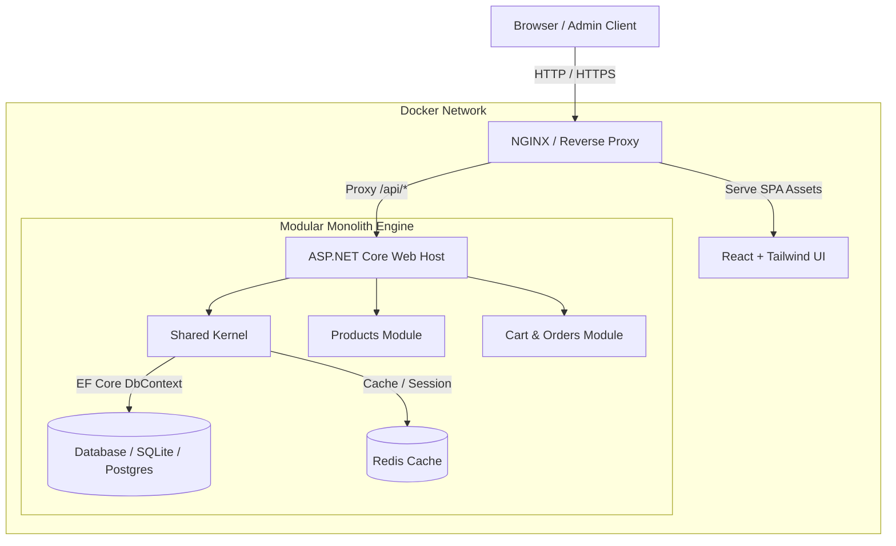
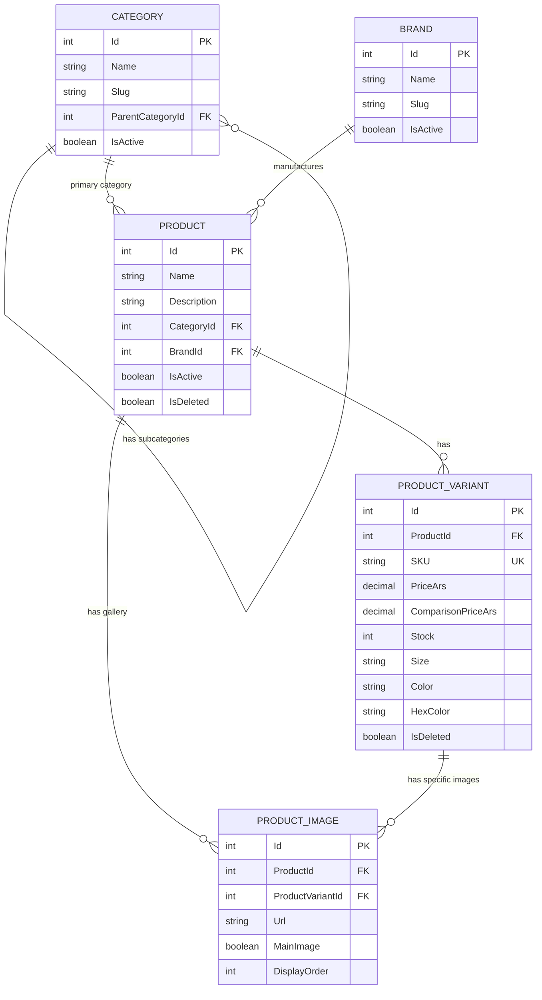

# E-Commerce Engine (.NET & React)

High-performance, modular backend API and modern frontend built with C# .NET and React, adhering to Clean Architecture principles, automated pipelines, and containerized deployment.

---

## Tech Stack

### **Backend**

* **Core:** .NET / ASP.NET Core Web API (C#)
* **Architecture:** Clean Architecture + Modular Monolith
* **Persistence (ORM):** Entity Framework Core (Code-First, Fluent API, Migrations)
* **Mapping:** Mapster (High-performance DTO projections)
* **Database:** SQLite (Development) / PostgreSQL (Production ready)
* **Testing & Tooling:** REST Client (`.http`), EF Core Design-Time Factory

### **Frontend**

* **Framework / Library:** React
* **Language:** TypeScript
* **Styling:** Tailwind CSS
* **Build Tooling:** Vite

---

## Roadmap & Planned Infrastructure

- [ ] **Containerization:** Full Dockerization of API & Frontend using Multi-stage `Dockerfile`.
- [ ] **Orchestration:** `docker-compose.yml` for unified local stack environment.
- [ ] **Gateway & Reverse Proxy:** NGINX / YARP configuration for static asset serving and `/api/*` routing.
- [ ] **Distributed Cache:** Redis integration for response caching and session state.

---

## Architecture & Infrastructure (C4 Model - Level 2)

The system follows a **Modular Monolith** pattern with strict boundary separation, orchestrated via Docker containers and exposed through a single entry gateway.

## Architecture & Infrastructure (C4 Model - Level 2)

The application follows a Modular Monolith pattern decoupled into independent domain layers, orchestrated via Docker Compose and routed through a reverse proxy.

